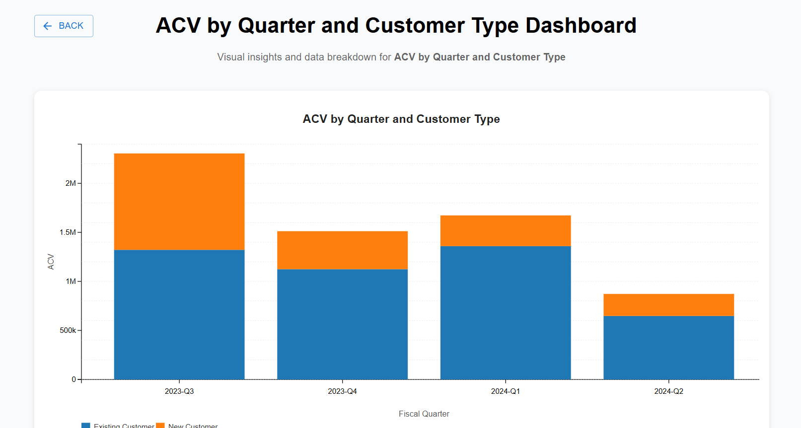
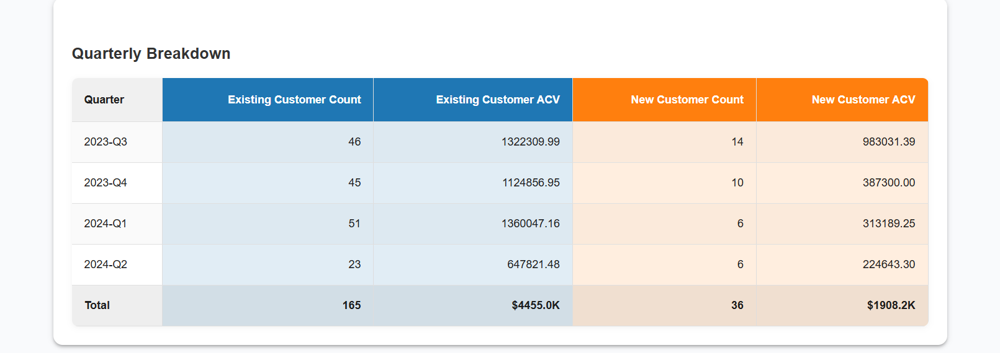

# Full Stack Application

This application is structured with two main folders: Frontend & Backend

---

## 📁 Folder Structure

- `frontend/` – React client application (Vite-based)
- `backend/` – Node.js + Express server

---

## ⚙️ Getting Started

### 1. Clone the repository

```bash
git clone https://github.com/shaiksha176/skygenie-assignment.git
cd skygenie-assignment
```

### 2. Backend set up

```bash
cd backend
npm install

```


To start the backend server with nodemon (for live reloading during development):

```bash
npm run dev
```

To start it normally (without nodemon):

```bash
npm  start
```

The backend will run at:
http://localhost:8080


### 3. Frontend set up

```bash
cd frontend
npm install

```


To start the app:

```bash
npm  start
```

The frontend will run at:
http://localhost:5173


## 🖼️ App Screenshots


<h3>🔸 Homepage</h3>


<h3>🔸 Stackedbar chart</h3>


<h3>🔸 Tabular view of data</h3>



